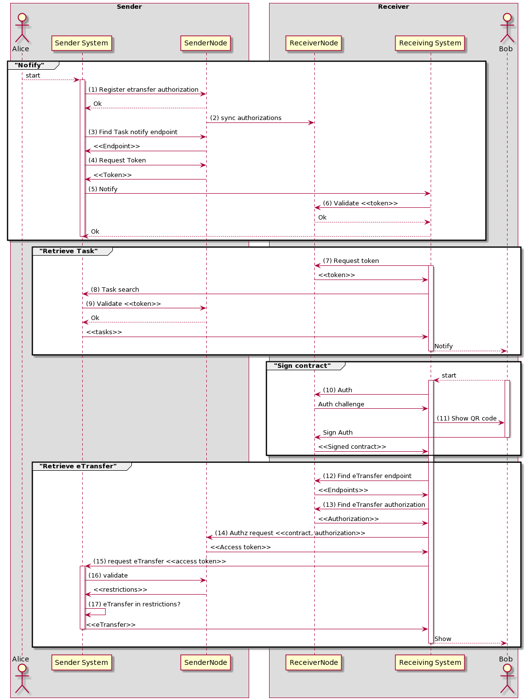

# Leveranciersspecificatie


_Dit werk valt onder een_ [_Creative Commons Naamsvermelding-GelijkDelen 4.0 Internationaal-licentie_](https://creativecommons.org/licenses/by-sa/4.0/)_._

## 1. Inleiding

Een moer is waardeloos zonder een bout, en evenzo is Nuts waardeloos zonder een Bolt. “Bolt” is onze term voor een concrete toepassing van het Nuts gedachtegoed en open technologie om een tastbare use-case in de zorg mogelijk te maken.

Voor u ligt de leveranciersspecificatie van de eOverdracht Bolt, zoals opgesteld door de samenwerkende softwareleveranciers in het Nuts initiatief. Dit document specificeert eenduidig hoe de digitale overdracht van een patiënt van de ene naar de andere instelling procesmatig en technisch zal plaatsvinden, met gebruikmaking van open standaarden.

Nictiz en V&VN hebben veel werk verzet voor het [specificeren van de eOverdracht](https://informatiestandaarden.nictiz.nl/wiki/vpk:V4.0_Ontwerp_eOverdracht). Naar goed gebruik is deze specificatie [infrastructuur agnostisch](https://informatiestandaarden.nictiz.nl/wiki/vpk:V4.0_Ontwerp_eOverdracht#Infrastructuur). Daarom is het nu tijd om onderling afspraken te maken over hoe we de specificatie van Nictiz op infrastructuur-niveau gaan implementeren. Hoe gaan we randvoorwaarden zoals notificaties, APIs, security en adressering regelen, zodat we ook op dit niveau duidelijke open standaarden hebben?

Dit document is primair bedoeld voor softwareleveranciers die aan willen sluiten bij de eOverdracht, en ten behoeve daarvan een implementatietraject gaan starten. Voor hen biedt dit document de noodzakelijke inzichten om tot een succesvolle koppeling te komen. Daarnaast beoogt dit document leesbaar te zijn voor betrokken zorginstellingen, zodat helder wordt of het proces van de eOverdracht zoals dat hier beschreven staat voldoet aan hun wensen.

Dit document is niet volledig. Het is op dit moment een levend document om tussen leveranciers tot werkende afspraken en technische oplossingen te komen. Er zal dus nog het één en ander in gaan veranderen in de komende maanden. Daarnaast is dit document ook vooral een index: op veel plekken zal het refereren naar bestaande standaarden en andere documentatie. Zo houden we dit document beknopt en leesbaar, en kunnen we de documentatie waar we naar verwijzen ook weer hergebruiken voor andere Bolts.

Wij wensen u veel leesplezier, en mocht dit document vragen bij u oproepen dan houden we ons aanbevolen [om die te beantwoorden](https://nuts.nl/contact/).

### 1.1 Verklarende woordenlijst

* Nuts — Een samenwerkingsverband van partijen in de zorg om tot een breed gedragen, open, decentrale infrastructuur te komen ten behoeve van de uitwisseling van gegevens in de zorg en het medische domein. Zie [www.nuts.nl](http://www.nuts.nl).
* Bolt — Een praktische toepassing van het Nuts gedachtegoed en open technologie om een tastbare usecase in de zorg mogelijk te maken.
* Verpleegkundige overdracht — Het administratieve proces van het verplaatsen van de verpleging van een patiënt naar een andere zorginstelling. Welke informatie heeft de ontvangende instelling nodig om die verpleging naadloos door te laten lopen?
* eOverdracht — Het proces van het digitaal overdragen van patiëntgegevens ter ondersteuning van de verpleegkundige overdracht.
* Bronhouder — De zorginstelling van waar de patiënt wordt overgedragen. Vanuit het perspectief van de eOverdracht dus de organisatie die patiëntgegevens heeft die moeten worden overgedragen.
* Bronsysteem — Het softwaresysteem dat de gegevens van de bronhouder beheert.
* Betrokkene — De patiënt die wordt overgedragen.
* Opvragende/bevragende/ontvangende partij — De zorginstelling die de patiënt ontvangt, en dus een informatiebehoefte heeft van gegevens van de bronhouder.
* Doelsysteem — Het softwaresysteem dat de gegevens van de opvragende partij beheert.
* Grondslag — Een wettelijke basis voor het mogen doorbreken van het beroepsgeheim van de bronhouder.

## 2. Procesbeschrijving

Met deze specificatie ondersteunen we het proces van de verpleegkundige overdracht waarbij een patiënt van de ene naar de andere zorginstelling wordt overgedragen. Dat kan bijvoorbeeld zijn omdat de patiënt vanuit een thuiszorgsituatie wordt opgenomen in het ziekenhuis of omdat de patiënt uit het ziekenhuis wordt ontslagen maar nog moet revalideren bij een andere zorginstelling. Voor een volledig overzicht zie de [informatiestromen zoals uitgewerkt door Nictiz](https://informatiestandaarden.nictiz.nl/wiki/vpk:V4.0_Ontwerp_eOverdracht).

We onderscheiden in dit proces drie stadia:

1. Er worden plekken gezocht waar de patiënt naartoe kan
2. De patiënt wordt aan deze zorginstellingen aangeboden
3. \(Een deel van\) het dossier van de patiënt wordt overgenomen

In de praktijk vinden stadia 1 en 2 vaak telefonisch plaats, terwijl stadium 3 via fax, post of een digitaal platform gebeurt. Er zijn voor alle drie de stadia commerciële oplossingen beschikbaar die zorginstellingen kunnen gebruiken, maar er is voor géén van deze stadia een open standaard waarmee tussen verschillende \(commerciële\) systemen kan worden overgedragen.

In de rest van dit hoofdstuk zullen we de verschillende stadia van dit proces verder uittekenen en voorzien van de nodige context om te begrijpen waar we de verpleegkundige overdracht goed mee ondersteunen.

### 2.1 Plekken zoeken

In het eerste stadium gaat het over het vinden van één of meerdere zorginstellingen die de benodigde zorg kunnen leveren aan de patiënt, en ook capaciteit beschikbaar hebben om die zorg te leveren. Dit wordt vaak “de marktplaats” of “vrije bedden zoeken” genoemd, ook al is er lang niet altijd sprake van een concreet bed.

In de beschikbare commerciële oplossingen wordt een marktplaats geboden waarop zorginstellingen hun beschikbare capaciteit aanbieden. Andere zorginstellingen kunnen die capaciteit daar inzien.

Een voordeel en een nadeel van deze constructie is dat het vaak een dubbele administratie vereist. De beschikbare capaciteit wordt doorgaans niet vanuit het bronsysteem overgenomen, maar handmatig ingevoerd. Dit heeft een duidelijk nadeel in de zin van het uitvoeren van werk dat mogelijk geautomatiseerd zou kunnen worden. Het voordeel hiervan is dat veel bronsystemen bijvoorbeeld wel vrije plekken registreren, maar dit niet kunnen correleren met beschikbare capaciteit van medewerkers of verwachte drukte. Een losse handmatige registratie kan de invoerder de gelegenheid bieden om naar eigen inzicht en uit verschillende bronnen informatie te combineren.

In technische en juridische zin is het publiceren van gegevens over je eigen organisatie geen grote uitdaging. We doen dagelijks niet anders op onze websites, bijvoorbeeld. Een bronsysteem of een andere applicatie die de zorginstelling rechtstreeks bij een leverancier afneemt zou dit publiceren voor de zorginstelling kunnen automatiseren, en instellingen in de regio zouden die informatie dan naar eigen goeddunken kunnen bevragen.

Echter, de meningen verschillen vrij sterk over hoe fijnmazig zo’n aanbod op zo’n marktplaats zou moeten zijn. Wordt alleen aangegeven welke typen patiënten verzorgd kunnen worden? Of ook wat de kwalificaties van het personeel zijn? En wat te denken van de beschikbare apparatuur? Hoe fijnmaziger het aanbod, hoe beter er kan worden gefilterd, maar tegelijk ook hoe meer werk het is voor de aanbiedende partij. En er zullen altijd uitzonderingen blijven waarbij toch even wordt gebeld om de twijfel weg te nemen.

Omdat er voor deze informatie nog geen data-standaard beschikbaar is en nog geen consensus lijkt te bestaan, laten we dit hele stadium momenteel buiten beschouwing. De noodzaak om dit stadium te digitaliseren lijkt ook niet zo groot, omdat organisaties in dezelfde regio vaak wel weten welke collega-instellingen ze moeten bellen voor bepaalde zorgbehoeftes, en omdat de telefoon dit bij twijfel goed oplost.

### 2.2 Patiënt aanbieden

Wanneer in grove lijnen duidelijk is welke organisaties de patiënt verder zouden kunnen helpen wordt het tijd om de patiënt aan te bieden aan die organisaties. Het is daarbij belangrijk om niet meer informatie te delen dan nodig is voor een goede beoordeling. Zie voor meer informatie over het juridische kader [§3.2](leveranciersspecificatie.md#32-wetgeving).

Het aanbieden van de patiënt aan andere organisaties kan plaatsvinden door het beschikbaar stellen van een aanmeldbericht. In dit aanmeldbericht staan die gegevens uit het dossier van de patiënt die relevant zijn voor de plaatsing. Het doelsysteem van de organisatie ontvangt een event of notificatie dat er een nieuw aanmeldbericht klaarstaat, en kan dit aanmeldbericht ophalen en tonen aan de gebruiker. De gebruiker kan dan geïnformeerd de keuze maken om de patiënt te accepteren of te weigeren. We willen dat de gebruiker daarbij een reden op kan geven, want er is verschil tussen “nee, want ik heb geen capaciteit beschikbaar” en “nee, want ik kan deze zorg niet leveren”.

Wanneer een bronhouder een patiënt aanbiedt aan collega-instellingen kunnen er drie dingen gebeuren:

1. Geen enkele organisatie accepteert de patiënt
2. Eén organisatie accepteert de patiënt
3. Meerdere organisaties accepteren de patiënt

In het eerste geval zal er waarschijnlijk nog een aanbod uitgezet moeten worden, of zal de transfermedewerker toch telefonisch contact moeten zoeken met collega-instellingen. In het tweede geval kan het dossier van de patiënt overgedragen worden. In het derde geval kan de keuze voor een organisatie voorgelegd worden aan de patiënt, diens familie of diens zorgverleners.

### 2.3 Dossier overdragen

Aan het einde van stadia 1 en 2 is er één organisatie bereid gevonden om de patiënt over te nemen, en is de patiënt daarover geïnformeerd. Daarmee is er formeel sprake van een overdracht, en op basis daarvan mogen dossiergegevens van de patiënt gedeeld worden met de ontvangende organisatie.

De overdracht wordt geregistreerd in het bronsysteem, waardoor een overdrachtsbericht beschikbaar wordt gesteld aan het doelsysteem. In het overdrachtsbericht staat het relevante deel van het dossier van de overgedragen patiënt. Het doelsysteem ontvangt hier een notificatie van. De leverancier van het doelsysteem kan de gebruiker notificeren dat er gegevens beschikbaar zijn.

Tenslotte kan de gebruiker zichzelf identificeren met een cryptografische handtekening en namens haar organisatie de dossiergegevens van de betreffende patiënt ophalen bij het bronsysteem. Hiermee kan de overdragende partij voldoen aan haar logging-eisen met betrekking tot de NEN7513. Wanneer de ZIBs naar behoefte zijn opgehaald kunnen ze het startpunt vormen voor de intake van de patiënt en diens voortgezette behandeling bij de nieuwe zorginstelling.

## 3. Oplossingsrichting/architectuur

Onderstaande paragrafen gegeven een architecturale oplossingsrichting voor het proces dat beschreven is in het vorige hoofdstuk. We nemen hierbij [het Nuts manifest](https://nuts.nl/manifest/) als leidraad.

### 3.1 Notified pull

In het ontwerp van deze Bolt gaan we uit van een notified pull. Dit houdt in dat gegevens niet actief gestuurd worden naar het doelsysteem \(push\) en dat het doelsysteem niet lukraak gegevens ophaalt \(pull\). In plaats daarvan stuurt het bronsysteem een notificatie naar het doelsysteem dat er specifieke gegevens klaar staan om opgehaald te worden. Alleen naar aanleiding van die notificatie haalt het doelsysteem de benodigde gegevens op.

Het voordeel van deze aanpak boven push is dat het doelsysteem gegevens alleen dan op hoeft te halen wanneer de ontvangende partij ook daadwerkelijk behoefte aan deze gegevens heeft. Op deze manier kan dus beter aan de eis van dataminimalisatie worden voldaan. Ook is het eenvoudiger om vast te stellen dat de persoon die gegevens ophaalt de juiste persoon is, en om te voldoen aan de NEN7513 en AVG verplichting om te loggen welke persoon de gegevens heeft ingezien. Vergelijk een persoonlijke e-mail inbox waar je inlogt om je e-mail op te halen met een faxmachine op de afdeling waar iedereen die langsloopt bij kan.

Het voordeel van deze aanpak boven enkel een pull mechanisme is timing en eenvoud van beveiliging. Wanneer het doelsysteem geen notificatie ontvangt moet er periodiek gepulled worden om te zien of er nieuwe gegevens staan te wachten. Analoog aan het constant herladen van een webpagina. Dit veroorzaakt veel onnodig extra netwerkverkeer en vertragingen in het ontvangen van berichten. Ook moet het bronsysteem dan bij elke pull het verzoek naast een complexe rechtenstructuur leggen om te ontdekken of de ontvanger het gevraagde bericht mag ophalen.

Het concept van notified pull is daarom de enige manier om alle gevraagde functionaliteit te ondersteunen, privacy te waarborgen en auditing op de juiste manier toe te passen. Het voorkomt onnodig kopiëren van gegevens tussen systemen en de bronhouder behoudt de volledige controle over wie er toegang krijgt tot gegevens.

De notificatie kan door de ontvangende partij gebruikt worden om direct een gebruiker te notificeren of andere processen in gang te zetten. De notificatie moet zo “dun” mogelijk zijn en geen persoons- en/of medische gegevens bevatten, om in verschillende stadia van het proces bruikbaar te zijn en vanwege het juridische kader dat we in de volgende paragraaf zullen beschrijven.

### 3.2 Wetgeving

De van toepassing zijnde wetteksten zijn:

* de WGBO \(wet op de geneeskundige behandelovereenkomst\);
* de Wabvpz \(wet aanvullende bepalingen verwerking persoonsgegevens in de zorg\);
* de AVG \(algemene verordening gegevensbescherming\);
* en straks mogelijk de Wegiz \(wet elektronische gegevensuitwisseling in de zorg\).

De WDO is niet relevant voor deze toepassing, aangezien deze het identificeren van patiënten regelt. In het kader van de eOverdracht hebben we alleen te maken met het identificeren van zorgverleners.

In de AVG \(Artikel 9 Lid 1 van de AVG en Artikel 22 lid 1 van de UAVG\) staat dat persoonsgegevens en bijzondere \(medische\) persoonsgegevens niet zonder meer verwerkt mogen worden. Het gaat hierbij om zowel de bronhouder als de ontvangende partij. De AVG noemt 6 gronden voor verwerking:

1. toestemming van de betrokkene
2. uitvoeren van een overeenkomst
3. wettelijke verplichting
4. vitaal belang van de betrokkene
5. uitvoeren van een publiekrechtelijke taak
6. gerechtvaardigd belang van de organisatie

Voor de bronhouder geldt de grond van wettelijke verplichting, dit is in de WGBO opgenomen. Voor de ontvangende partij liggen de zaken wat minder eenvoudig.

Als er overeenstemming is wie de ontvangende partij gaat worden, en de betrokkene reeds expliciet toestemming heeft gegeven voor de overdracht, dan geldt de WGBO. Daar staat namelijk in dat in het geval van overdracht of verwijzing de gegevensuitwisseling het proces volgt.

Als er nog geen overeenstemming is wie de ontvanger gaat worden, dan geldt de WGBO niet; er is nog geen behandelrelatie en nog geen verwijzing. Dit betekent dat de ontvangende partijen de persoonsgegevens en zelfs het BSN \(zie Wabvpz\) van de betrokkene niet mogen verwerken. Punten 2 t/m 6 van de AVG zijn immers niet van toepassing. Punt 1, toestemming van de betrokkene, zou een mogelijkheid bieden om wel persoonsgegevens door te sturen. Dit zou betekenen dat in het proces toestemming aan de betrokkene gevraagd moet worden voor elke organisatie waar de overdracht naar uitgezet wordt.

Dit is een onnodige extra administratieve last voor de zorg en de betrokkene, want het is voor de evaluatie van het ziektebeeld en het bepalen of de patiënt geplaatst kan worden niet relevant over welk individu het gaat. We kunnen daarom de hoeveelheid data in het aanmeldbericht minimaliseren, en alleen niet-identificerende gegevens versturen. In dat geval is er namelijk sprake van geanonimiseerde gegevens en deze vallen niet onder de AVG.

### 3.3 Beveiliging & vertrouwen

In het notified pull scenario haalt de ontvangende partij gegevens op bij de bronhouder. De bronhouder, als gegevensbeheerder, moet zich ervan vergewissen dat de opvragende partij inderdaad bij de gegevens mag.

Bij het opvragen is naast de opvragende partij ook een specifieke gebruiker en het doelsysteem betrokken. Het is het doelsysteem dat, technisch gezien, de gegevens ophaalt en toont aan de gebruiker. Het is de gebruiker die daadwerkelijk inzage krijgt in de gegevens. Om te voorkomen dat ongeoorloofden de gegevens kunnen ophalen en inzien moet het bronsysteem de volgende zaken kunnen controleren:

1. Welk doelsysteem verbinding maakt
2. Dat het doelsysteem als verwerker optreedt voor de opvragende partij
3. Namens welke natuurlijke persoon het doelsysteem verbinding maakt
4. Dat deze persoon de opvragende partij vertegenwoordigt

Ervan uitgaande dat er behoefte is aan een zo open mogelijke oplossing, waarbij elke partij evenveel kansen krijgt in de markt en waarbij de beveiliging van een erg hoog niveau is, is het gebruik van cryptografische bewijzen noodzakelijk. Elke van de bovengenoemde controles moet met behulp van een cryptografische handtekening uitgevoerd kunnen worden. Immers, elke oplossing die gebruik zou maken van een actieve trusted third party voor deze controles zou die partij in staat stellen om de markt te beïnvloeden of “op slot” te zetten, en zou een security hotspot en single point of failure vormen in het ontwerp.

[RFC002 §7](https://nuts-foundation.gitbook.io/drafts/rfc/rfc002-authentication-token#7-supported-means) Specificeert welke middelen geaccepteerd moeten worden voor de persoonlijke identificatie. Middelen die noodzakelijk zijn voor de identificatie van organisaties zijn nog in ontwikkeling.

### 3.4 Scheiding proces en autorisatie

Het is de ambitie van Nuts om tot een breed inzetbare en flexibele infrastructuur te komen voor data-uitwisselingen in de zorg en het medische domein. Dit vereist dat we ons voor elke Bolt weer opnieuw de vraag stellen: welke delen van dit proces zijn uniek voor deze use case en welke zijn generiek herbruikbaar?

Als we kijken naar de verpleegkundige overdracht dan zijn er twee aspecten waarop een antwoord geformuleerd moet worden: hoe organiseren we het proces van aanbieden, accepteren en afwijzen van een patiënt en hoe organiseren we het beschikbaar stellen van dossiergegevens?

In veel andere use cases komen diezelfde aspecten terug, maar niet altijd samen. Neem bijvoorbeeld een uitvoeringsverzoek, waarbij arts en zorgverleners een proces delen van vraag en acceptatie of verwerping, maar zonder dat er noodzakelijk dossiergegevens uitgewisseld worden. Of neem de Bolt zorginzage, waarin dossiergegevens beschikbaar gesteld worden aan andere zorginstellingen zonder dat daar een dergelijk proces aan te pas komt. Het ligt daarom voor de hand om een scheiding aan te brengen tussen het organiseren van processen en het organiseren van gegevenstoegang.

Het loskoppelen van het overdrachtsproces en de autorisatie voor gegevenstoegang heeft als bijkomend voordeel dat één applicatie het proces kan afhandelen terwijl een andere applicatie, of meerdere applicaties, gebruik zouden kunnen maken van de gegevenstoegang. Je kunt je voorstellen dat het systeem dat het overdrachtsproces faciliteert wordt afgenomen bij een leverancier die zich daarin specialiseert, terwijl de dossiergegevens opgeslagen staan, en inzichtelijk gemaakt worden vanuit, het EPD/ECD/XIS, dat in veel gevallen van een andere leverancier zal komen. Het biedt ook de mogelijkheid dat bijvoorbeeld zowel vanuit een dossiersysteem als vanuit een intakesysteem \(van verschillende leveranciers, maar binnen dezelfde zorginstelling\) gegevens kunnen worden opgehaald ten behoeve van dezelfde verpleegkundige overdracht.

Deze constructie maakt het eenvoudiger om gegevens bij de bron te houden en vanaf verschillende kanten te bekijken. Zonder ze domweg te kopiëren van het bronsysteem naar het systeem dat het proces ondersteunt, en nogmaals naar het dossiersysteem. Wel betekent het dat het overdrachtsproces zal moeten leiden tot autorisaties voor gegevensuitwisseling. Die constructie zullen we in hoofdstuk vier verder verkennen.

### 3.5 Open & inclusief

We kiezen in het ontwerp van deze Bolt voor open standaarden, volgens het principe van comply or campaign. Er worden geen verplichtingen gesteld tot het gebruik van bepaalde services of software. Elke partij is vrij om te kiezen of ze gebruik maken van ondersteunende diensten zolang deze diensten geen eisen of restricties opleggen aan andere partijen.

In de basis betekent dit dat er uitgegaan wordt van een gedistribueerde oplossing, waarbij elke partij gelijk is en waarbij zonder tussenkomst van derden, twee partijen rechtstreeks met elkaar gegevens kunnen uitwisselen inzake de verpleegkundige overdracht.

## 4. Data inhoudelijk/Specs

Het uitwisselen van gegevens in het notified pull scenario is onder te verdelen in twee grote onderdelen: het procesmatige deel en het ophalen van de gegevens. In dit hoofdstuk zullen we die beide aspecten van de uitwisseling verder uitwerken.

Er wordt zo veel mogelijk uitgegaan van breed toepasbare en gestandaardiseerde oplossingen die ook buiten de verpleegkundige overdracht gebruikt kunnen worden.

Het [technisch ontwerp](https://informatiestandaarden.nictiz.nl/wiki/vpk:V4.0_FHIR_eOverdracht) van Nictiz bevat veel inhoudelijke aspecten van de gegevensuitwisselingen. Deze Bolt omschrijving vult dit aan met infrastructurele zaken.

Sommige onderdelen zijn op dit moment verder uitgewerkt dan andere. Waar mogelijk wordt verwezen naar bestaande standaarden. Waar een onderdeel nog niet voldoende is uitgewerkt zal besproken worden wat er nog mist en hoe tot een oplossing gekomen kan worden. Het is mogelijk dat het vinden van een oplossingsrichting in een later stadium onderdeel moet worden van de verdere samenwerking tussen de verschillende leveranciers.

### 4.1 Proces tracking

De juiste doelsystemen moeten genotificeerd worden, zodat de ontvangende partijen weten dat er een overdracht naar de organisatie gedaan zou kunnen worden. Het notificeren zal zowel voor het aanmeldbericht als het daadwerkelijke overdrachtsbericht plaatsvinden. Bij het aanmeldbericht dient deze notificatie ertoe dat het aanbod ter verificatie geëvalueerd kan worden. De notificatie voor het overdrachtsbericht heeft als doel de ontvangende partij te notificeren dat er meer gegevens beschikbaar zijn.

Ook is het noodzakelijk om de voortgang van het proces te kunnen monitoren. Elk aanbod moet daarom een status hebben: is het een nieuw aanbod, is deze in overweging of is hij afgewezen? Uiteindelijk zal de overdracht aan één partij moeten worden toegewezen.

#### 4.1.1 Task resource

De [task resource](https://www.hl7.org/fhir/task.html) wordt gebruikt om de voortgang van een uitgezette taak bij te houden. De bronhouder is verantwoordelijk voor het uitzetten van de taak. Wanneer de bronhouder met meerdere partijen een aanmeldbericht wil delen, zal voor elke ontvangende partij een task moeten worden aangemaakt. De bronhouder is ervoor verantwoordelijk dat voor gerelateerde tasks er uiteindelijk maar één toegewezen wordt aan een ontvangende partij. Vanwege deze verantwoordelijkheid en vanwege het principe van gegevens aan de bron zal de task opgeslagen worden in het bronsysteem. Het doelsysteem wordt genotificeerd en kan de task ophalen. Bij elke wijziging in de task zal het bronsysteem een notificatie sturen.

Zie [§3.4](https://informatiestandaarden.nictiz.nl/wiki/vpk:V4.0_FHIR_eOverdracht) van de technische specificatie.

Qua gegevens kan de task een referentie bevatten naar het aanmeldbericht. Als de task de status `in-progress` krijgt kan tevens een referentie naar het overdrachtsbericht worden toegevoegd. Voor het overdrachtsbericht is dan geen aparte task nodig.

#### 4.1.2 Organisatie endpoint discovery

De bronhouder is belast met het notificeren van de juiste ontvangende partijen. Bij het selecteren van die partijen doen zich een aantal uitdagingen voor:

1. Heeft een beoogde ontvangende partij een doelsysteem dat de eOverdracht ondersteunt?
2. Wat is het technische adres van dit doelsysteem?
3. Is het doelsysteem te vertrouwen? Met andere woorden: is de leverancier van het doelsysteem daadwerkelijk een verwerker van de ontvangende partij?

Voor het vinden van de ontvangende partij wordt gebruik gemaakt van het Nuts register volgens [RFC006](https://nuts-foundation.gitbook.io/drafts/rfc/rfc006-distributed-registry) van de Nuts specificatie. Om de overdracht te ondersteunen moeten zowel de verzendende partij als ontvangende partij een dienst registreren in het register.

Diensten kunnen per leverancier en/of organisatie geregistreerd worden volgens de [service specificatie](https://nuts-foundation.gitbook.io/drafts/rfc/rfc006-distributed-registry#4-services). Voor de verzendende partij dient er een `eOverdracht-sender` dienst geregistreerd te worden:

```javascript
{
  "id": "did:nuts:organization_identifier#F1Dsgwngfdg3SH6TpDv0Ta1aOE",
  "type": "eOverdracht-sender", 
  "serviceEndpoint": {
    "oauth": "did:nuts:vendor_identifier/serviceEndpoint?type=production-oauth",
    "fhir": "did:nuts:vendor_identifier/serviceEndpoint?type=eOverdracht-sender-fhir"
  }
}
```

het `type` moet hierin `eOverdracht-sender` zijn. Het `id` zal volgens de specificatie moeten worden opgesteld. Het `serviceEndpoint` moet de velden `oauth` en `fhir` bevatten. Beide waardes moeten een dynamische verwijzing hebben naar een endpoint zoals gespecificeerd in [RFC006](https://nuts-foundation.gitbook.io/drafts/rfc/rfc006-distributed-registry). Het endpoint waarnaar verwezen wordt vanuit het `fhir` veld moet een `serviceEndpoint` hebben welke verwijst naar het fhir `[base]` path zoals beschreven in de technische specificatie van Nictiz. Het endpoint waarnaar verwezen wordt vanuit het `oauth` veld moet een `serviceEndpoint` hebben welke verwijst naar het `accesstoken` endpoint van een OAuth authentication server. Het type in het query veld mag daarbij door de leverancier zelf gekozen worden. De dynamische verwijzingen uit het voorbeeld verwijzen bijvoorbeeld naar de endpoints die de leverancier geregistreerd heeft:

```javascript
{
    "id": "did:nuts:vendor_identifier#F1Dsgwngfdg3SH6TpDv0Ta1aOE",
    "type": "eOverdracht-sender-fhir", 
    "serviceEndpoint": "https://fhir.example.com/base"
}
```

```javascript
{
    "id": "did:nuts:vendor_identifier#F1Dsgwngfdg3SH6TpDv0Ta1aOE",
    "type": "production-oauth",
    "serviceEndpoint": "https://nuts.example.com/n2n/auth/v1/accesstoken"
}
```

Voor de ontvanger dient een `eOverdracht-receiver` dienst geregistreerd te worden:

```javascript
{
    "id": "did:nuts:organization_identifier#F1Dsgwngfdg3SH6TpDv0Ta1aOE",
    "type": "eOverdracht-receiver", 
    "serviceEndpoint": {
        "oauth": "did:nuts:vendor_identifier/serviceEndpoint?type=production-oauth",
        "notification": "did:nuts:vendor_identifier/serviceEndpoint?type=eOverdracht-receiver-notify"
    }
}
```

Met het endpoint:

```javascript
{
    "id": "did:nuts:vendor_identifier#F1Dsgwngfdg3SH6TpDv0Ta1aOE",
    "type": "eOverdracht-receiver-notify",
    "serviceEndpoint": "https://notify.example.com/specific/path"
}
```

Dit laatste endpoint dient het `[base]` path te zijn waarop notificaties ontvangen kunnen worden middels de `Task` resource. De volgende paragraaf beschrijft het notificatie mechanisme. Het betreft dus een notificatie dat er een nieuwe \(of gewijzigde\) `Task` resource klaar staat bij verzendende partij. Het path mag niet geregistreerd worden met een `/` op het einde.

#### 4.1.3 Notificatie protocol

Het FHIR STU3 notificatie en [subscriptions](http://hl7.org/fhir/STU3/subscription.html) model geeft onvoldoende ondersteuning voor deze bolt.
Zonder een verwijzing naar de specifieke Task zal een FHIR *search* operatie moeten plaats vinden. 
Task resources in een FHIR database zijn alleen te relateren aan FHIR *Organizations*. 
Binnen de security context van waaruit de call gedaan wordt zijn deze niet beschikbaar.   
Er is daarom gekozen om de specfieke Task identifier op te nemen in het notificatie pad.
Dit wordt heroverwogen wanneer FHIR versie 5 gebruikt gaat worden.
Het Task notificatie endpoint is specifiek voor deze bolt en zou niet voor andere doeleinden gebruikt moeten worden.

Wanneer er een task wordt toegevoegd zal het bronsysteem een notificatie \(lege POST volgens FHIR documentatie\) sturen naar het eerder geregistreerde endpoint van het doelsysteem. Dit is een signaal aan het doelsysteem om de FHIR task resource op te halen. Deze task kan opgehaald worden zonder geïdentificeerde gebruiker. Dit betekent dat de task resource geen persoonsgegevens (of referenties waarmee een persoon uniek geidentificeerd kan worden) mag bevatten.

De beveiliging zal geschieden volgens [RFC003](https://nuts-foundation.gitbook.io/drafts/rfc/rfc003-oauth2-authorization).

### 4.2 Data uitwisselingen

#### 4.2.1 Grondslag

Zoals beschreven in [§3.4](leveranciersspecificatie.md#34-scheiding-proces-en-autorisatie) scheiden we het overdrachtsproces van de autorisatie voor gegevenstoegang. Dit betekent dat er naast de task die het proces beheert ook een mechanisme aanwezig moet zijn dat de toegang tot gegevens regelt.

In [§3.2](leveranciersspecificatie.md#32-wetgeving) staat beschreven op basis van welke grondslagen gegevens verwerkt mogen worden. Een verwijzing is een geldige grondslag, een mogelijke verwijzing \(in het geval van een aanmeldbericht\) in beginsel niet.

De verschillende processtappen in de verpleegkundige overdracht vereisen een bepaalde toegang tot gegevens. Evenzo zullen verschillende toestanden van de task resource leiden tot bepaalde toegang:

* Requested    → toegang tot aanmeldbericht
* Accepted    → toegang tot aanmeldbericht
* Rejected    → alle toegang ingetrokken
* Cancelled    → alle toegang ingetrokken
* In-progress → toegang tot overdrachtsbericht
* Completed    → alle toegang ingetrokken

Het concept van een grondslag verbindt welke ontvangende partij toegang krijgt tot welke gegevens bij welke bronhouder inzake welke patiënt. En hoewel er voor het aanmeldbericht dus geen valide grondslag is om persoonsgegevens te verwerken, is het voor de implementatie wel handig om beide berichten via eenzelfde mechanisme toegankelijk te maken. De grondslag is onderdeel van een speciaal autorisatie record, deze is beschreven in [RFC014](https://nuts-foundation.gitbook.io/drafts/rfc/rfc014-authorization-credential).

In het kader van de verpleegkundige overdracht zal de autorisatie een verwijzing bevatten naar het aanmeldbericht. Dit is dan ook meteen de scope waartoe de ontvanger van de grondslag toegang heeft.

Een ander voordeel van autorisaties is dat de ook de patient een overzicht in het PGO kan krijgen wie welke gegevens waarom kan inzien.

#### 4.2.2 Inhoud

Voor de eOverdracht is door Nictiz een lijst met zorg-informatie-bouwstenen \(ZIBs\) gedefinieerd. Deze bouwstenen zijn een feitelijke omschrijving van alle informatie benodigd voor een overdracht.

De ZIBs beschrijven de benodigde data, maar beschrijven niet hoe deze door computersystemen kunnen worden uitgewisseld. Daarvoor maken we gebruik van HL7 FHIR. De profielen voor de eOverdracht worden door Nictiz beheerd en worden gepubliceerd op de website van [Simplifier](https://simplifier.net/Nictiz-STU3-eOverdracht). De mapping van een ZIB naar FHIR is vaak niet een-op-een. Zo wordt de ZIB Persoonsgegevens gemapt op de FHIR profielen: Patient, Coverage en Related Person. Zie voor de complete mapping van ZIBs op FHIR profielen voor de eOverdracht [deze tabel](https://informatiestandaarden.nictiz.nl/wiki/vpk:V4.0_FHIR_eOverdracht#HCIMs). De set van FHIR resources die samen de overdracht vormen worden gebundeld in een [FHIR Composition](https://www.hl7.org/fhir/STU3/composition.html).

Volgens de specificatie is het mogelijk om persoonsgegevens op te nemen in het aanmeldbericht. Dit is niet altijd toegestaan vanuit de wetgeving. De verzendende partij moet hier rekening mee houden. Zie ook [§2.2.2](https://informatiestandaarden.nictiz.nl/wiki/vpk:V4.0_Ontwerp_eOverdracht) van het Nictiz functioneel ontwerp.

##### 4.2.2.1 Aanvullende documenten

Niet alle informatie uit de eOverdracht ZIBs kunnen gestructureerd worden verzonden. Nictiz heeft in de [Informatiestandaard](https://informatiestandaarden.nictiz.nl/wiki/vpk:V4.0_FHIR_eOverdracht#Exchanging_data_as_unstructured_text) gedefineerd hoe deze informatie in één PDF/a kan worden toegevoegd aan de eOverdracht .

Aanvullende op de specificatie van Nictiz zal de referentie in de [FHIR DocumentReference](http://hl7.org/fhir/stu3/documentreference.html) een Binary moeten bevatten. Andere niet-FHIR verwijzingen zijn niet toegestaan in verband met het Nuts Authorization Credential.

Aanvullende zal deze bolt voorzien om gegevens te versturen die buiten de eOverdracht gegevens liggen. Deze worden optioneel toegevoegd aan het aanmeld- of overdrachtsbericht \(FHIR Compostion\). Hiervoor kan de verzender in een extra sectie DocumentReference entries toevoegen aan de Composition. De DocumentReference moet een verwijzing hebben naar een [FHIR Binary](http://hl7.org/fhir/stu3/binary.html). De code voor deze sectie is snomed code '397966007' \(Documents\). De Binary mag alleen een PDF/a zijn. 

#### 4.2.3 Context

Naast de informatie over welke FHIR resource opgehaald kan worden is het ook nodig om te specificeren in welke context dit gebeurt. De context moet namelijk gebruikt worden voor de beveiliging, zo moet er bekend zijn:

1. Wat is de identiteit van de gebruiker?
2. Vanuit welke partij komt het request?
3. Vanuit welk doelsysteem komt het request?
4. Vanuit welke bronhouder wordt de data beschikbaar gesteld?

Daarnaast zouden er nog extra attributen opgenomen kunnen worden indien nodig. Elke van bovenstaande punten wordt gedekt door [RFC003](https://nuts-foundation.gitbook.io/drafts/rfc/rfc003-oauth2-authorization)

#### 4.2.4 Beveiligde verbinding

Alle requests worden gedaan over een mTLS verbinding. Naast het servercertificaat is er ook nog een client-certificaat benodigd. Het client-certificaat identificeert het doelsysteem.

Er wordt gebruik gemaakt van PKIoverheid certificaten voor zowel het server certificaat als het client certificaat. Zie ook [RFC008](https://nuts-foundation.gitbook.io/drafts/rfc/rfc008-certificate-structure).

#### 4.2.5 Authenticatie & Autorisatie

Als bronsysteem heb je de verantwoordelijkheid de data te beschermen van de bronhouder. Het is dus van groot belang een degelijk autorisatie en authenticatie model te hebben. Dit hoofdstuk beschrijft de techniek om de FHIR endpoints te beveiligen middels de veelgebruikte OAuth 2.0 specificatie \[[RFC6749](https://tools.ietf.org/html/rfc6749)\].

Voor het verkrijgen van een authorization token biedt OAuth 2.0 diverse type flows. In tegenstelling tot de veel gebruikte gebruikersnaam en wachtwoord flow, moet een identiteit verstuurd worden die onomstotelijk kan worden bewezen door middel van cryptografie. Hierdoor is het mogelijk dat de third-party cliënt \(in ons geval het doelsysteem\) de gebruiker identificeert en diens identiteit, ondertekend met een certificaat, doorstuurt naar de authorization server \(beheerd door het bronsysteem\). Deze OAuth flow wordt beschreven in [RFC7523](https://tools.ietf.org/html/rfc7523).

In het request staat:

* Een identiteit van de gebruiker
* Een bewijs dat de gebruiker voor de opvragende partij werkt
* Een beperking in tijd
* Een beperking in scope
* Een digitale handtekening van het doelsysteem

Gegeven deze informatie en de aanwezige vertrouwensinformatie in het bronsysteem kan vastgesteld worden dat de gebruiker, de opvragende partij en het doelsysteem gerelateerd zijn.

De gegevens van het request worden na succesvolle verificatie omgezet in een signed access token en teruggestuurd. Dit access token kan dan in de volgende requests gebruikt worden om toegang te krijgen tot de juiste informatie. Hiervoor hoeft alleen de handtekening van het access token gecontroleerd te worden.

Wanneer er is vastgesteld wie toegang wil hebben tot welke gegevens kan aan de hand van de uitgegeven grondslagen gecontroleerd worden of dit is toegestaan. In de grondslag staat immers welke opvragende partij bij welke resource mag. Verschillende grondslagen kunnen natuurlijk gecombineerd worden zodat een gebruiker van een opvragende partij toegang krijgt tot meerdere resources. Dit mechanisme ondersteunt dus automatisch ook meer use cases dan enkel de verpleegkundige overdracht.

Zie [RFC003](https://nuts-foundation.gitbook.io/drafts/rfc/rfc003-oauth2-authorization) voor de volledige specificatie.

#### 4.2.6 Auditing

Omdat de identiteit van de gebruiker en de opvragende partij zijn vastgelegd in het access token kunnen deze ook worden gelogd door het bronsysteem, waarmee voldaan is aan de NEN7513 eisen inzake logging. Deze logging kan dan ook \(bijvoorbeeld via een PGO\) inzichtelijk gemaakt worden voor de patiënt.

#### 4.2.7 Service autorisatie

Vanuit [RFC014](https://nuts-foundation.gitbook.io/drafts/rfc/rfc014-authorization-credential) is er de verplichting om voor elke Bolt een access policy te definiëren. Een policy beschrijft hoe het autorisatie record opgesteld moet worden en waar het vervolgens toegang tot geeft. Alleen de bronhouder moet een autorisatie record aanmaken \(`eOverdracht-sender`\). Een autorisatie record voor de service `eOverdracht-sender` geeft geen algemene rechten tot resources. Alleen de resources die onder de restricties worden geregistreerd zijn toegankelijk. H6 beschrijft de access policies.

## 5. Implementatie

Het [functioneel](https://informatiestandaarden.nictiz.nl/wiki/vpk:V4.0_Ontwerp_eOverdracht) en [technisch](https://informatiestandaarden.nictiz.nl/wiki/vpk:V4.0_FHIR_eOverdracht#FHIR_profiles) ontwerp van Nictiz, de Nuts specificaties en hoofdstuk 4 bevatten alle benodigde informatie voor het implementeren van de eOverdracht. De informatie is echter verspreid waardoor het moeilijk is om te bepalen wanneer nu welke actie vereist is. Dit hoofdstuk probeert daar zo goed mogelijk antwoord op te geven.

### 5.1 Aanbieden

Aan dit deel wordt gewerkt.

### 5.2 Accepteren/Verwerpen

Aan dit deel wordt gewerkt.

### 5.3 Ophalen overdrachtsbericht

Het ophalen van het overdrachtsbericht begint wanneer de verpleegkundige overdracht toegewezen is aan een enkele ontvangende partij. Het proces van de voorgaande paragrafen is afgerond of er is sprake van een rechtstreekse overdracht waarbij een cliënt bijvoorbeeld weer terugkeert in zorg na bijvoorbeeld een tijdelijke opname.

Voordat de ontvangende partij genotificeerd kan worden is het de taak van de bronhouder om zowel het overdrachtsbericht als de bijbehorende Task resource te prepareren. Het is de bronhouder vrij om deze van tevoren klaar te zetten of ze realtime te genereren. De inhoud van het overdrachtsbericht moet een FHIR Composition resource zijn volgens de definities van het [Nictiz TO](https://informatiestandaarden.nictiz.nl/wiki/vpk:V4.0_FHIR_eOverdracht#FHIR_profiles). De Task resource zal gevuld moeten worden volgens het **eOverdracht-Task** FHIR profiel. Een verwijzing hiernaar is te vinden op de website van [Nictiz](https://informatiestandaarden.nictiz.nl/wiki/vpk:V4.0_FHIR_eOverdracht#Task). Belangrijk hierbij is dat de `Task.status` en `Task.input:nursingHandoff` velden gevuld zijn.

Onderstaand flow diagram toont alle stappen van notificeren tot ophalen. Wanneer er gegevens uitgewisseld worden tussen _Sender_ en _Receiver_ gebeurt dit altijd over een verbinding die is beveiligd met mutual TLS. Zie ook [RFC008](https://nuts-foundation.gitbook.io/drafts/rfc/rfc008-certificate-structure) voor het gebruik van certificaten. De verschillende stappen worden in de volgende paragrafen uitgelegd.



### 5.3.1 Registreren autorisatie

**2-3** In één van de eerste stappen wordt het Nuts autorisatie record geregistreerd. Hiervoor dient [RFC014](https://nuts-foundation.gitbook.io/drafts/rfc/rfc014-authorization-credential) gevolgd te worden. Zie §6.2.2 voor de invulling van het autorisatie record.

**4.** Het Nuts netwerk zorgt voor de aflevering van het autorisatie record bij de juiste ontvangende Nuts node.

### 5.3.2 Notificatie

**5-6** De bronhouder zoekt in de Nuts node naar het endpoint om de Task notificatie naar toe te sturen. Het base endpoint bevindt zich in het `notification` veld van de `eOverdracht-receiver` service van de ontvangende organisatie. Het endpoint waar de notificatie heen moet is een combinatie van het _base_ endpoint en de task identifier, bijv: `base/7EA74998-6A5F-4455-B35E-B6D36B9A0EA3`. Zie ook [§4.1.2](leveranciersspecificatie.md#412-organisatie-endpoint-discovery)

**7.** De bronhouder vraagt een access token aan de Nuts node. Het token wordt aangevraagd in de context van de beide partijen en de bolt.

**8-10** De node vraagt volgens [RFC003](https://nuts-foundation.gitbook.io/drafts/rfc/rfc003-oauth2-authorization) een access token aan bij de authorization server van de ontvangende partij.

**11.** Er wordt een notificatie gestuurd middels een lege POST naar het endpoint vanuit stap 5. Het security token uit stap 10 wordt hierbij als autorisatie header meegestuurd. De `Accept` header moet gezet worden conform de eisen van een FHIR API call.

**12.** Het doelsysteem valideert het access token bij de Nuts node.

**14.** Bij een correct verwerking zal de ontvangende partij een `202 Accepted` teruggeven met een lege body. Bij een incorrecte verwerking kan de ontvangende partij een `40x` of `50x` HTTP status code teruggeven. Bij een `400` status code mag de ontvangende partij een body meegeven, indien dit gedaan wordt dan moet dit een FHIR STU3 [OperationOutcome](http://hl7.org/fhir/STU3/operationoutcome.html) zijn.

### 5.3.3 Ophalen Task

Het doelsysteem is nu op de hoogte van een nieuwe of gewijzigde Task resource. Het security token dat in stap 11 gebruikt is, bevat het bronsysteem.

**15-21** De notificatie uit stap 11 bevatte een autorisatie header met daarin oa de identifiers van de bronhouder en de ontvangende partij. Het doelsysteem kan hiermee bepalen waar de Task opgehaald moet worden. Het endpoint van de Task FHIR URL is te vinden in het `fhir` veld van de `eOverdracht-sender` service van de bronhouder. Dit is de `base` URL van de FHIR service. Daar moet nog het relatieve pad van de Task resource (`Task`) en de specifieke identifier aan toegevoegd worden. Het access token gaat net zoals bij stap 11 mee in een header. Het bronsysteem is verantwoordelijk voor het vinden van de juiste Task resource. Omdat het security token geen gebruikersinformatie bevat, mogen er nooit persoonsgegevens meegestuurd worden in de Task.

**22-24** Het bronsysteem controleert het access token en bepaalt aan de hand daarvan de bronhouder en de opvragende partij. Samen met de gegeven query parameters bevat dit voldoende informatie om de juiste Task resource\(s\) terug te geven.

### 5.3.4 Authenticatie

**26-28** Het ontvangende systeem zal op verzoek van de gebruiker een authenticatie flow starten met een door de gebruiker gekozen authenticatiemiddel. We nemen in deze beschrijving IRMA als authenticatiemiddel. Andere authenticatiemiddelen zullen een soortgelijke flow gebruiken. Er wordt een authenticatie sessie gestart op de Nuts node. Deze geeft een _contract_ en _sessie ID_ terug. [RFC002](https://nuts-foundation.gitbook.io/drafts/rfc/rfc002-authentication-token) bevat de details.

**29-31** Het resultaat van stap 10 wordt als QR code weergegeven voor de gebruiker. De gebruiker scant de QR code met de camera van zijn/haar device. Het _contract_ dat in stap 27 is aangemaakt wordt op het device van de gebruiker getoond. De gebruiker ondertekent dit _contract_ met de gevraagde attributen. Het device stuurt het ondertekende contract naar de Nuts node waarna het ontvangende systeem het resultaat zal ophalen. Het ondertekende contract dient opgeslagen te worden in de sessie van de gebruiker. Het contract is voor langere tijd geldig zodat deze stap niet elke keer doorlopen hoeft te worden. 

### 5.3.5 Ophalen overdrachtsbericht

Het ontvangende systeem zoekt in de Nuts node naar het endpoint waar het overdrachtsbericht opgehaald kan worden. Het base endpoint bevindt zich in het `fhir` veld van de `eOverdracht-sender` service van de bronhouder. De URL waar het overdrachtsbericht opgehaald kan worden staat in de opgehaalde Task onder `Task.input:nursingHandoff`. Deze URL zou een combinatie van het `base` path uit stap 15 en het relatieve pad voor het overdrachtsbericht onder `Task.input:nursingHandoff` moeten zijn.

**32.** Nu bekend is wat het bronsysteem is kan er een access token worden aangevraagd. Dit is gelijk aan de stappen 15 t/m 20 m.u.v. dat er nu ook gebruikersinformatie en een autorisatie record aanwezig moeten zijn. Het autorisatie record, het service ID, de bronhouder, de ontvangende partij en het ondertekende contract zullen allemaal onderdeel zijn van de access token aanvraag.

**33.** Met het access token in de juiste header kan het overdrachtsbericht opgehaald worden bij de URL zoals aangegeven in de Task resource.

**34-37** Het bronsysteem laat het access token controleren door de Nuts node. Deze zal o.b.v. de gebruikte autorisatie records ook de mogelijke resources teruggeven die geraadpleegd mogen worden. Het bronsysteem kijkt of de gevraagde resource, in dit geval het overdrachtsbericht, onderdeel is van die resources.

### 5.3.6 afronden overdracht

Voor het wijzigen van de Task is een access token nodig. Hiervoor kan hetzelfde access token gebruikt worden die ook bij stap 32 is gebruikt indien de geldigheid van het access token dit toelaat. Indien het updaten van de Task op een later tijdstip plaats vindt of als het token verlopen is, zullen stap 15 t/m 20 nogmaals doorlopen moeten worden. Als ook het contract van de gebruiker niet meer geldig is, dan zullen stappen 26 t/m 31 ook doorlopen moeten worden.

**41.** Het ontvangende systeem wijzigt de `Task.status` van `in-progress` naar `completed`. De Task wordt middels een `PUT` request gestuurd naar het juiste pad volgens het [Nictiz](https://informatiestandaarden.nictiz.nl/wiki/vpk:V4.0_FHIR_eOverdracht) TO §3.2.2. Het `base` path is afkomstig vanuit het endpoint wat in stap 15 is opgehaald.

**42-44** Het bronsysteem laat het access token controleren door de Nuts node. Deze zal o.b.v. de gebruikte autorisatie records ook de mogelijke resources teruggeven die geraadpleegd mogen worden. Het bronsysteem kijkt of de gevraagde resource, in dit geval de Task resource, onderdeel is van die resources.

**45-46** Als de autorisaties het toestaan kan het bronsysteem de task updaten. Het controleert hierbij of alleen de status is aangepast.

**47-49** Nu de overdracht voltooid is kan het bronsysteem de relevante autorisatie records intrekken. De Nuts node zorgt er dan voor dat de intrekkingen bekend zijn bij andere nodes.

**50** Het updaten van de Task zorgt er tenslotte voor dat er een notificatie naar het ontvangende systeem gaat.

## 6. Access policy

Een onderdeel van een Bolt is de beschrijving van de autorisaties tot bepaalde resources.  De autorisaties worden beschreven in een access policy. Het is de taak van een resource server om de policy te volgen wanneer resources worden opgevraagd.

Deze eOverdracht Bolt omvat twee verschillende access policies. De belangrijkste is de `eOverdracht-sender` policy aangezien die toegang biedt tot daadwerkelijke gegevens. Daarnaast is er nog de `eOverdracht-receiver` policy die toegang regelt voor de notificaties.

### 6.1 eOverdracht-receiver policy

De `eOverdracht-receiver` policy beschrijft alleen de toegang tot het Task notificatie endpoint. Bij het aanvragen van een access token op de authorization server zijn geen [Nuts Authorization Credentials](https://nuts-foundation.gitbook.io/drafts/rfc/rfc014-authorization-credential) nodig. Ook is er geen gebruikersinformatie nodig. De `vcs` en `usi` velden in de [JWT grant](https://nuts-foundation.gitbook.io/drafts/rfc/rfc003-oauth2-authorization#4-2-2-payload) mogen dus leeg zijn. Het `purposeOfUse` veld moet in ieder geval `eOverdracht-receiver` bevatten.

De resource server van de ontvangende partij moet controleren dat er voor het notificatie endpoint een `POST` request wordt gedaan zonder body. Het gaat hierbij om een relatief pad t.o.v. wat er geregistreerd staat onder het `notification` veld in de `eOverdracht-receiver` service. Achter dit pad mag alleen nog een resource identifier staan.

### 6.2 eOverdracht-sender policy

De `eOverdracht-sender` policy bevat zowel regels voor persoonsgebonden als niet-persoonsgebonden resources. Voor de niet-persoonsgebonden resources geldt dat het `usi` veld in de [JWT grant](https://nuts-foundation.gitbook.io/drafts/rfc/rfc003-oauth2-authorization#4-2-2-payload) leeg mag zijn.

#### 6.2.1 Niet-persoonsgebonden resources

**6.2.1.1 Ophalen task** 

Het ophalen van de gewijzigde task valt onder de niet-persoonsgebonden resources.
Omdat het hierbij gaat om de toegang tot een enkele resource, is er een [Nuts Authorization Credential](https://nuts-foundation.gitbook.io/drafts/rfc/rfc014-authorization-credential) nodig. Het credential moet voldoen aan de volgende eisen:

* De `issuer` moet het DID bevatten van de versturende partij.
* `credentialSubject.id` moet het DID van de ontvangende partij bevatten.
* `credentialSubject.purposeOfUse` moet gelijk zijn aan `eOverdracht-sender`.
* `credentialSubject.resources` moet de specifieke Task bevatten: `/Task/[id]`.

De resource server moet controleren of het gevraagde request gelijk is aan:

```text
GET [base]/Task/[id]
```

Waarbij `[base]` vervangen moet worden door het pad zoals deze is geregistreerd onder het `fhir` veld in de `eOverdracht-sender` service. De resources server moet ook de Task selecteren o.b.v. het access token. Bij de aanvraag voor het access token is meegestuurd welke organisatie de aanvraag doet en voor welke organisatie deze bedoeld is.

**6.2.1.2** **Updaten task resource**

Een onderdeel van de eOverdracht is dat de ontvangende partij de status van de Task aanpast. Hiervoor dient het een request te doen zoals beschreven in [§3.2.2 van het Nictiz TO](https://informatiestandaarden.nictiz.nl/wiki/vpk:V4.0_FHIR_eOverdracht#Task_invocations). Omdat het hierbij gaat om de toegang van een enkele resource, is er een [Nuts Authorization Credential](https://nuts-foundation.gitbook.io/drafts/rfc/rfc014-authorization-credential) nodig. Het gaat hierbij om hetzelfde credential als beschreven in de vorige paragraaf.

#### 6.2.2 Persoonsgebonden resources

Het ophalen van het overdrachtsbericht en alle aanverwante gegevens vereisen een geregistreerde autorisatie in de vorm van een [Nuts Authorization Credential](https://nuts-foundation.gitbook.io/drafts/rfc/rfc014-authorization-credential). Het credential moet voldoen aan de volgende eisen:

* De `issuer` moet het DID bevatten van de versturende partij.
* `credentialSubject.id` moet het DID van de ontvangende partij bevatten.
* `credentialSubject.purposeOfUse` moet gelijk zijn aan `eOverdracht-sender`.
* `credentialSubject.subject` moet het BSN bevatten als OID: `urn:oid:2.16.840.1.113883.2.4.6.3:999999990`.

De `eOverdracht-sender` policy geeft geen toegang tot gegevens anders dan die onder `resources` vermeld staan in het credential. `resources` moet in ieder geval de volgende waardes bevatten:

* path: `/task/[ID]`, operations: `["read", "update"]`, userContext: `false`. `[ID]` moet hierbij vervangen worden door een echt ID. Deze waarde geeft lees en update rechten op de task resource.
* path: `/compositon/[id]`, operations: `["read", "document"]`, userContext: `true`. `[ID]` moet hierbij vervangen worden door een echt ID. De `document` operatie wordt in FHIR vertaald naar het pad: `/Compositon/[id]/$document`. Dit betreft lees rechten op het overdrachtsbericht.
* path: `/[path]`, operations: `["read"]`, userContext: `true`. Voor elke FHIR reference die voorkomt in het overdrachtsbericht moet een waarde worden opgenomen. `/[path]` moet daarbij vervangen worden door de FHIR reference.

Bij de aanvraag van het access token moet het credential volgens bovenstaande eisen meegestuurd worden in het `vcs` veld. Daarnaast moet er gebruikersinformatie meegestuurd worden in het `usi` veld. Het `purposeOfUse` veld moet de waarde `eOverdracht-sender` bevatten.

### 6.3 Intrekken autorisatie

Wanneer de overdracht voltooid is, is het niet langer nodig voor de ontvangende partij om gegevens op te halen. Het autorisatie credential kan dan ingetrokken worden. Wanneer de status van de Task geupdate wordt naar completed, dan moet de verzendende partij het credential intrekken. Indien de ontvangende partij vergeet om het proces af te ronden dan staat het de verzendende partij vrij om het credential na een redelijke periode in te trekken.

## Appendix A. Integratie voorbeelden

Deze bijlage geeft een aantal voorbeelden hoe de concepten uit de eerdere hoofdstukken te vertalen zijn naar verschillende integratie mogelijkheden. Er worden slechts enkele uiteenlopende voorbeelden gegeven om een idee te krijgen van de flexibiliteit van de gekozen richting. Deze bijlage is niet-normatief.

Voor zowel de ontvangende als de versturende kant zijn drie voorbeelden opgenomen, deze dragen dezelfde namen, maar zijn geen afhankelijkheid van elkaar. De ontvangende staat volledig los van de versturende kant.

Legenda:

* AAA —  Authenticatie, Autorisatie en Auditing. De security gateway die zorgt voor de gegevensbeveiliging. De autorisatie gebeurt o.b.v. de aanwezige grondslagen. Het uitwisselen van de grondslagen staat niet expliciet in de modellen, maar is wel noodzakelijk voor dit component.
* Broker — Andere dan de XIS/ECD leverancier die functionaliteit beschikbaar stelt voor de verpleegkundige overdracht.
* API — Een specifieke gegevensdienst voor het betreffende XIS/ECD, hoeft niet gebaseerd te zijn op enige standaard. Beveiligd. 
* Data proxy — Communicatie module om met specifieke API van XIS/ECD te communiceren.
* Medische data — Logische component/systeem waar de medische gegevens staan opgeslagen. Dit kan meerdere systemen betreffen.
* Medisch professional — De professional die gegevens in het dossier registreert.
* Medisch secretariaat — Of vergelijkbare afdeling die de zorgvraag voor de overdracht kan beoordelen.
* Resource server — De FHIR resource server. Stelt gegevens beschikbaar via ZIBs.
* Tasks — Logisch component/systeem voor opslag van gegevens voor volgen overdrachtsprocedure.
* Transfer professional — De professional die die overdracht klaar zet of beoordeelt.
* Transfer UI — Gebruikersinterface van de transfer professional.
* UI — Gebruikersinterface van de medisch professional.

De blauwe pijlen geven interactie van de gebruiker weer en de rode pijlen geven gegevensstromen weer. Het slotje bij een gebruiker wil zeggen dat deze geauthenticeerd is volgens de oauth beschrijving.

### A.1 Aanbiedende partij

#### A.1.1 Embedded scenario

In het embedded scenario is één leverancier verantwoordelijk voor het bijhouden van het overdrachtsproces en voor het beschikbaar stellen van de benodigde gegevens. Dit is het geval wanneer een XIS/ECD leverancier de benodigde functionaliteit voor de verpleegkundige overdracht implementeert in het XIS/ECD.


#### A.1.2 Hybride scenario

In het hybride scenario is er een scheiding aangebracht in het beschikbaar stellen van de gegevens en het afhandelen van de verpleegkundige overdracht. Het XIS/ECD beschikt in dit scenario over een resource server die ZIBs over FHIR beschikbaar stelt. In dit scenario komen dergelijke gegevens rechtstreeks uit het XIS/ECD. De broker handelt in dit geval het overdrachtsproces af. De broker maakt het mogelijk via de transfer UI om de ontvangende zorginstellingen te selecteren en om de juiste gegevens te selecteren. Ook het aanmeldbericht en het overdrachtsbericht zijn dan de verantwoordelijkheid voor de broker. Deze hebben echter wel verwijzingen naar resources die bij het XIS/ECD opgeslagen zijn. Om de juiste gegevens te selecteren moet er wel een koppeling zijn tussen broker en XIS/ECD. Hoe die koppeling er uit ziet valt buiten deze specificatie. Bij het selecteren van de juiste gegevens moet de broker ook de juiste grondslag vastleggen zodat de AAA service de juiste autorisatie kan toepassen.


#### A.1.3 Delegate scenario

Het delegate scenario gaat er van uit dat het XIS/ECD geen enkele ondersteuning heeft en ook niet zal gaan bieden voor het ontsluiten van ZIBs over FHIR. In dit geval handelt de broker en het proces af en voorziet het in de gegevensontsluiting. In de praktijk komen de gegevens wel vanuit het XIS/ECD, maar zal de broker deze omvormen naar ZIBs. De data-proxy handelt dit voor de broker af. Het kan zijn dat het hier gaat om het kopiëren van gegevens, maar ook dat gegevens real-time omgezet worden naar ZIBs. Ook in dit scenario zal de broker bij de gegevens uit het XIS/ECD moeten kunnen om de transfer professional te kunnen ondersteunen.


### A.2 Ontvangende partij

#### A.2.1 Embedded scenario

Dit is de evenknie van het proces aan de versturende kant. Alle functionaliteit wordt door het XIS/ECD geïmplementeerd. Zowel de professionals die de aanvraag beoordelen als de medische professionals die de zorg opstarten zullen geauthenticeerd moeten zijn volgens de in H4 vermelde methode. Een verschil is dat de beoordelend professional alleen het aanmeldbericht zal hoeven in te zien, terwijl de medisch professional het volledige overdrachtsbericht nodig heeft om dossiervorming te starten. Het synchroniseren van de tasks kan gebruikt worden om de beoordelend professional een signaal te geven dat er een nieuwe overdracht wordt aangeboden. Het updaten van de tasks gaat nog altijd via de versturende kant. Het XIS/ECD kan zelf ZIBs over FHIR verwerken en tonen aan de gebruiker.


#### A.2.2 Hybride scenario

Het hybride scenario is voor de ontvangende klant bijna exact hetzelfde als het embedded scenario. Er zou een verschil kunnen zitten in hoe de medisch professional op de hoogte wordt gebracht dat er een nieuwe patiënt is. In het embedded scenario kan het XIS/ECD dit via interne logica regelen, terwijl er in het hybride scenario twee mogelijkheden zijn: De broker notificeert het XIS/ECD via een custom koppeling of het XIS/ECD reageert op het aanwezig zijn van een grondslag omtrent een overdracht waarbij een overdrachtsbericht beschikbaar is gekomen.


#### A.2.3 Delegate scenario

In dit scenario neemt de broker ook het verwerken van de ZIBs over FHIR voor zijn rekening en levert dit aan het XIS/ECD op een verwerkbare manier.


