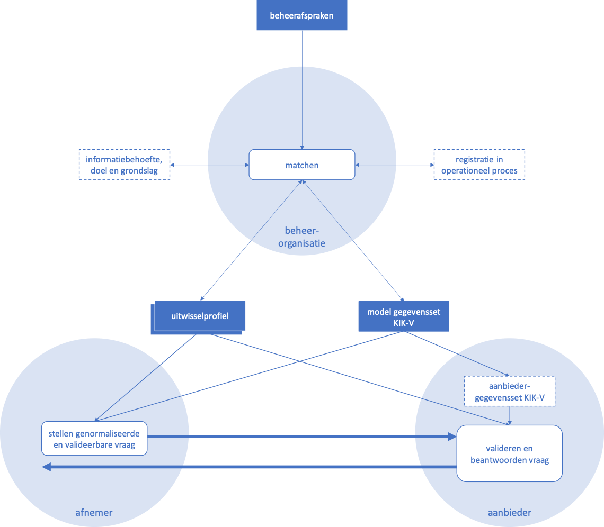
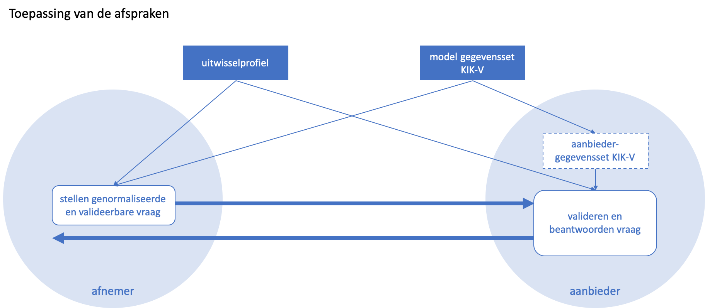
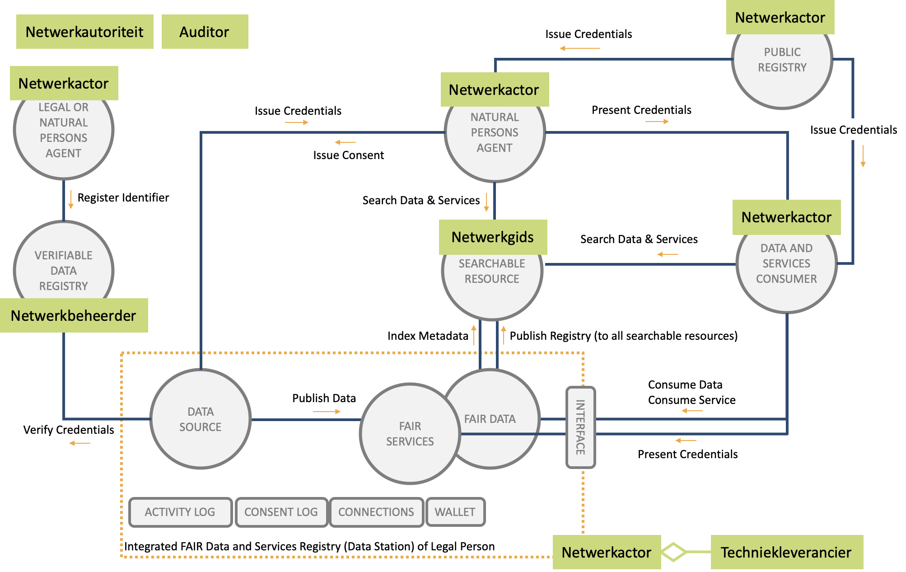

# Inleiding

## Grondplaat

De grondplaat beschrijft de kern van de oplossing zoals deze wordt afgesproken en ontwikkeld voor keteninformatie kwaliteit verpleeghuiszorg \(KIK-V\). De actuele versie van de afspraken kan worden opgevraagd bij Zorginstituut Nederland. Zie ook [https://www.kik-v.nl](https://www.kik-v.nl/) voor meer informatie.

De afsprakenset bestaat uit drie typen producten:

* **Beheerafspraken \(één\):** de beheerafspraken zijn een verzameling verantwoordelijkheden voor de uitvoering van de beheeractiviteiten;
* **Uitwisselprofielen \(één of meer\):** een uitwisselprofiel is een verzameling verantwoordelijkheden van de rollen afnemer en aanbieder, die gelden voor een set van een of meer vragen en antwoorden en moeten worden toegepast in de operationele gegevensuitwisseling. Het profiel kan betrekking hebben op een of meer lagen en aspecten uit het interoperabiliteitsmodel;
* **Modelgegevensset KIK-V \(één\):** de modelgegevensset KIK-V is een verzameling definities van gegevenselementen die worden gebruikt in de uitwisseling van informatie over de kwaliteit van verpleeghuiszorg.

De afsprakenset kent verantwoordelijkheden die worden gekoppeld aan de rollen van:

* **Afnemer** \(van gegevens\);
* **Aanbieder** \(van gegevens\): dit zijn de instellingen voor verpleeghuiszorg;
* **Beheerorganisatie**: dit betreft zowel de besluitvorming als de uitvoering.

### Toepassing van de afspraken in dit scenario

* De afsprakenset bevat afspraken over het vraag-antwoordspel tussen afnemers en aanbieders, gericht op het uitwisselen van kwaliteitsinformatie over verpleeghuiszorg.
* Een afnemer is verantwoordelijk voor het stellen van zijn vraag:
  * Op een genormaliseerde manier: de vraag moet gesteld zijn in termen van de modelgegevensset KIK-V \(de ontologie\), zodat die vraag door de aanbieder kan worden beantwoord met zijn aanbiedergegevensset KIK-V;
  * Op een valideerbare manier: de vraag moet gekoppeld worden aan en passen binnen een uitwisselprofiel.
* Een aanbieder is verantwoordelijk voor:
  * Het valideren van de vraag, om vast te stellen dat die voldoet aan een uitwisselprofiel waaraan de aanbieder zich heeft verbonden, en daarmee is gelegitimeerd; alleen dan behoeft die beantwoord te worden. Ten behoeve van validatie zijn alle goedgekeurde uitwisselprofielen door het uitvoerend orgaan op een voor aanbieders en afnemer toegankelijke plek gepubliceerd;
  * Het beantwoorden van de vraag, waarbij hij gebruik maakt van zijn aanbiedergegevensset KIK-V: een verzameling gegevens over de eigen organisatie die voldoen aan de modelgegevensset KIK-V.
* De afnemer mag ervan uit gaan dat de aanbieder over een aanbiedergegevensset KIK-V beschikt, die voldoet aan de modelgegevensset KIK-V. Of en hoe de aanbieder dit feitelijk implementeert, wordt niet voorgeschreven.

## Componenten in het netwerk

In onderstaande figuur zijn de componenten benoemd die in een ecosysteem \(het netwerk van actoren die zich committeren aan een set van afspraken\) kunnen zijn opgenomen. Op de componenen zijn de rollen geplaatst, zoals deze in DIZRA zijn gespecificeerd, die de eindverantwoordelijkheid dragen voor de verwerkingen in het component. De netwerkautoriteit ziet toe op naleving van de afspraken in het ecosysteem. Een auditor ondersteunt hierbij door audits uit te voeren en een derdenverklaring uit te geven waarmee een netwerkactor, een netwerkgids of een netwerkbeheerder kan bewijzen dat zij aan de afspraken voldoet. Voor meer informatie, zie [https://dizra.gitbook.io/dizra/](https://dizra.gitbook.io/dizra/).

**Legal or natural persons agent** - Een software agent van een mens of organisatie \(rechtspersoon\), zie [https://en.wikipedia.org/wiki/Software\_agent](https://en.wikipedia.org/wiki/Software_agent). Een software agent kan verwerkingen geautomatiseerd uitvoeren namens een persoon of een organisatie waarbij het in alle gevallen van belang is dat de persoon of organisatie regie heeft op de uitwisseling van gegevens. Een software agent kan echter ook een applicatie zijn met een mens-machine interactie.

Een software agent bevat minimaal de componenten connections en wallet.

De software agents die in de andere componenten zijn beschreven, zijn specialisaties van de generieke legal or natural persons agent.

**Natural persons agent** - Een software agent van een natuurlijk persoon, bijvoorbeeld een cliënt in de langdurige zorg. De software agent van een natuurlijk persoon kan verschillende toepassingen hebben, waaronder: toestemmingsvoorziening, persoonlijke gezondheidsomgeving, index met gegevens waar de persoon geregistreerd is of een toepassing voor self-sovereign identity. In een toepassing voor self-sovereign identity moet de persoon altijd zelf de actie uitvoeren om verklaringen over zichzelf te presenteren aan anderen.

**Public register** - Een register van een bevoegde instantie \(een organisatie\). Deze instantie is bevoegd en capabel \(op basis van afspraken of een wettetlijke grondslag\) om een verklaring uit te geven over een persoon of organisatie. In de afsprakenset van KIK-V heeft de beheerorganisatie een publiek register. Een public register is eveneens een software agent.

Indien gebruik wordt gemaakt van een PKI-Certificaten, dan voert de certificaatautoriteit \(CA\) het public register voor de uitgifte van certificaten.

**Verifiable data registry** - Een register zoals bedoeld in [https://www.w3.org/TR/vc-data-model/](https://www.w3.org/TR/vc-data-model/)

**Searchable resource** - Een doorzoekbaar register met metadata zoals bedoeld in [https://www.go-fair.org/fair-principles/](https://www.go-fair.org/fair-principles/)

**Data and services consumer** - Een software agent van een organisatie die acteert als afnemer van data en services. Het component wordt ook consumer genoemd.

**Integrated FAIR Data and Services Registry \(Data Station\) of Legal Person** - Een software agent van een organisatie die acteert als aanbieder van data en services.

**Data Station of datastation** - Zie Integrated FAIR Data and Services Registry

**Data source** - Een informatiesysteem dat een databron is voor het aanbieden van data in het datastation. Het is een component van een datastation.

**FAIR services** - Een service die vindbaar, toegankelijk en interoperabel is en is opgezet volgens de principes van FAIR-data om hergebruik en meervoudig gebruik van data mogelijk te maken. Het is een component van een datastation.

**FAIR data** - Data die vindbaar, toegankelijk en interoperabel is en is opgezet volgens de principes van FAIR-data om hergebruik en meervoudig gebruik van data mogelijk te maken. In de afsprakenset van KIK-V wordt daarvoor gebruik gemaakt van een ontologie. Deze is technisch uitgevoerd met de standaarden van de W3C semantic web stack. FAIR data is een component van een datastation en bestaat veelal uit een triple-store als database en een SPARQL-endpoint.

**Activity Log** - Log voor het vastleggen van de verwerkingsactiviteiten van de afnemer en de aanbieder. Met de log wordt eveneens de raadpleging van persoonsgegevens vastgelegd. Activity Log is een component van een datastation en van een data en services consumer.

**Consent Log** - In de log zijn de verklaringen van toestemming \(en hun status\) vastgelegd die door personen zijn uitgegeven als grondslag voor toegang tot zijn of haar persoonsgegevens. Consent Log is een component van een datastation.

**Connections** - Register van verbindingen met software agents. Het register wordt gebruikt om bijvoorbeeld een organisatie en haar software agents te blacklisten. Connections is een component van een software agent.

**Wallet** - Register voor de opslag van vertrouwelijke gegevens zoals de private key van een organisatie of de verklaringen waar de organisatie of persoon houder van is. Een wallet moet versleuteld zijn. Een wallet is een component van een software agent.

**Interface** - De interfaces voor het toegankelijk maken van de data en de services. Voor het toegankelijk maken van de data en de services kunnen verschillende architectuurstijlen en protocollen gehanteerd worden zoals RESTful, GraphQL, OpenID Connect, OAuth2, Linked data etc. Een interface is een component van een datastation.

Met **credentials** wordt in de figuur een verifiable credential bedoeld zoals beschreven in [https://www.w3.org/TR/vc-data-model/](https://www.w3.org/TR/vc-data-model/).

**Verklaring** wordt gehanteerd als Nederlandse term voor verifiable credentials.

Voor de realisatie van KIK-V worden de volgende componenten gebruikt:

* Public Register voor de uitgifte van de verklaring gevalideerde vraag;
* Public register voor de uitgifte van PKI-certificaten voor domein en organisatie;
* Verifiable data registry;
* Searchable resource;
* Data and services consumer;
* Datastation.

